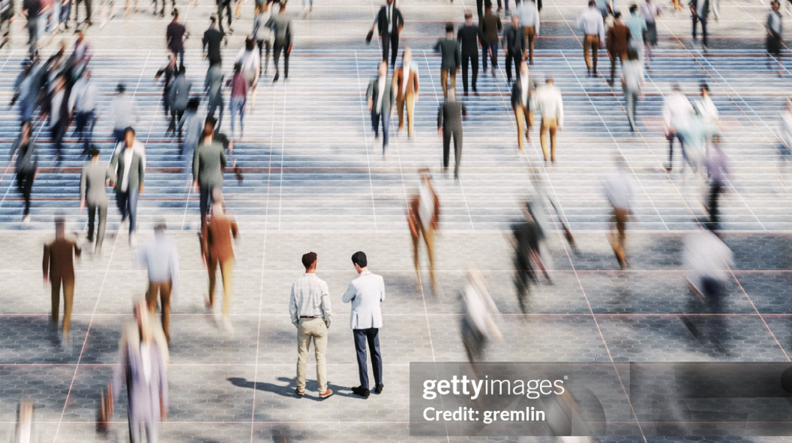

# 🧍‍♂️ YOLO-based Human Detection System

A deep learning-based Human Detection system built using **YOLOv8**.  
This project detects **humans and high-visibility (hi-vis) objects** from images and videos, and is fully containerized using **Docker** for easy deployment.

---

## 🚀 Features

- 🔍 Real-time Human Detection using YOLOv8  
- 🦺 Detection of **Hi-Vis (Safety Jackets)**  
- 🖼️ Image & 🎥 Video inference support  
- 📦 Dockerized for easy deployment  
- ⚡ Lightweight and efficient (YOLOv8n)  
- 📊 Custom-trained dataset support  

---

## 🧠 Model Details

- Model: **YOLOv8 (Nano version)**
- Classes:
  - `person`
  - `hi-vis`
- Framework: Ultralytics YOLOv8

---

## 📁 Project Structure

```
.
├── YOLO-HiVis-Data/
├── data.yaml
├── train.py
├── test.py
├── prepare_dataset.py
├── Dockerfile
├── requirements.txt
├── runs/
├── yolov8n.pt
├── Test.png
├── Test-1.png
```

---

## 📸 Sample Results

### 🖼️ Original Image


### 🔍 Detected Output


---

## ⚙️ Installation (Local)

### 1️⃣ Clone the repository
```bash
git clone https://github.com/your-username/YOLO-based-Human-Detection.git
cd YOLO-based-Human-Detection
```

### 2️⃣ Install dependencies
```bash
pip install -r requirements.txt
```

### 3️⃣ Run detection
```bash
python test.py
```

---

## 🐳 Docker Setup

### 1️⃣ Build Docker Image
```bash
docker build -t yolo-app .
```

### 2️⃣ Run Container
```bash
docker run yolo-app
```

👉 Output will be saved as:
```
output.jpg
```

---

## 🏋️ Training

To train the model:

```bash
python train.py
```

Dataset structure:

```
YOLO-HiVis-Data/
├── train/
│   ├── images/
│   ├── labels/
├── val/
│   ├── images/
│   ├── labels/
```

---

## 📊 Results

- mAP50: ~0.88  
- mAP50-95: ~0.67  
- Good performance on both **person** and **hi-vis detection**

---

## 🔮 Future Improvements

- 🎥 Real-time webcam detection  
- 📊 Person counting system  
- 🚨 Safety alert system (missing hi-vis detection)  
- 🌐 Web deployment (Flask/Streamlit)  

---

## 👨‍💻 Author

**Navdeep Singh**  
Computer Engineering Student  

---

## ⭐ Acknowledgements

- Ultralytics YOLOv8  
- Open-source computer vision community  

---

## 📌 Note

This project demonstrates training, evaluation, and deployment of an object detection model using YOLOv8.
